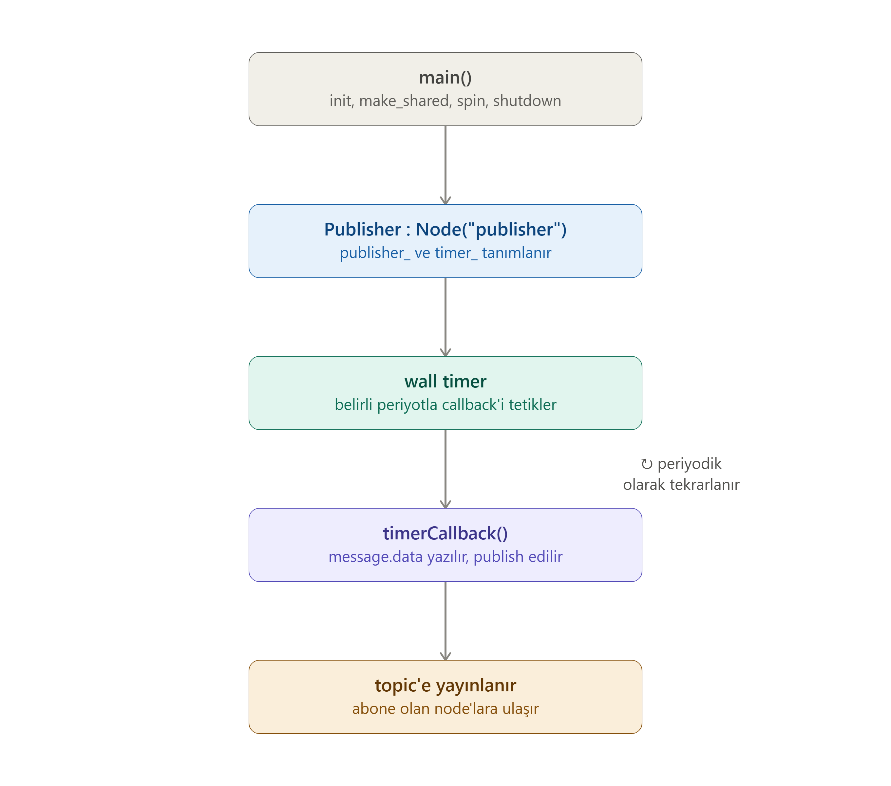

# ÖZET 

Öncelikle temelde oluşturmamız gereken 3 şey var: 
1. Publisher 
2. Subscriber
3. Test 

Değiştirilecek dosyalar: 
- `CMakeLists.txt`
- `package.xml`

# PUBLISHER 

Bizim topladığımız verileri belirli bir topic kanalı üzerinden broadcast yayınlayan node.
1. gerekli kütüphaneleri include etmek 
   1. rclcpp/rclcpp.hpp 
   2. std_msgs/msg/string.hpp 
2. rclcpp'den Node'u miras alan bir class oluştur 
3. Class constructerı içinde node ismini belirle `Publisher: Node("publisher")`: 
   - public: 
      1. `create_publisher<mesaj_tipi>(topic_ismi, queue_depth)`
      2. `create_wall_timer(period, std::bind(&class::callback), node_base)`
      3. `RCLCPP_INFO(get_logger(), mesaj);`
   - timerCallback() fonksiyonu 
     1. Mesajın data type objecti : `auto message = std_msgs::msg::String();`
     2. `message.data = ne yazacaksa + str(count_)`
     3. `publisher_->publish(message)`
   - private:
     1. kullandığımız değişkenleri, fonksiyonları kısa hallerde yazıyoruz, rclcpp üzerinden gelen publisher ve timer'ı kısaltarak kullanıyoruz. 
4. int main
   1. init
   2. auto node_adı = `std::make_shared<class_name>();`
   3. `spin(node_adı)`
   4. `rclcpp::shutdown();` 

# SUBSCRIBER

# GTEST

